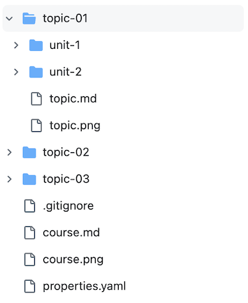
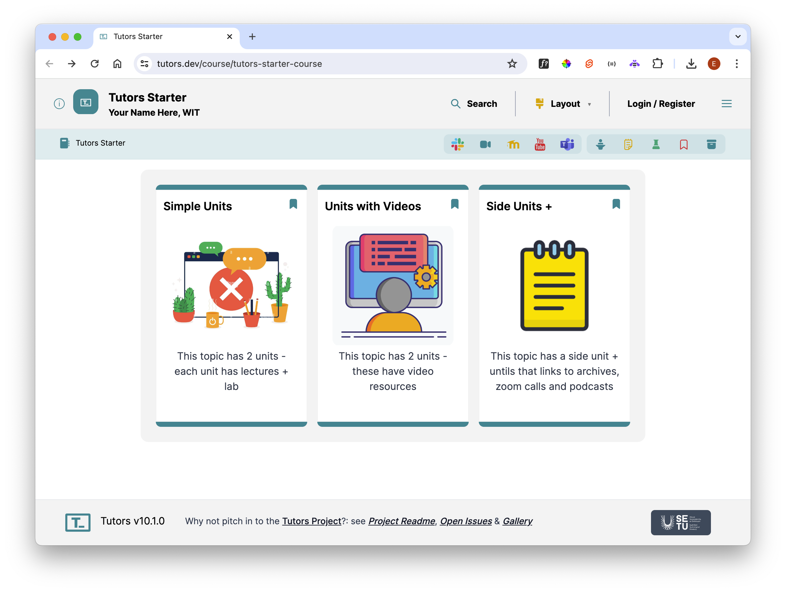
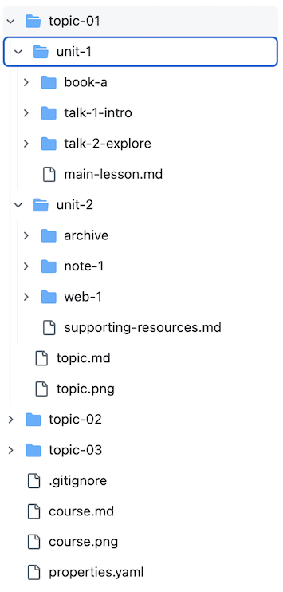
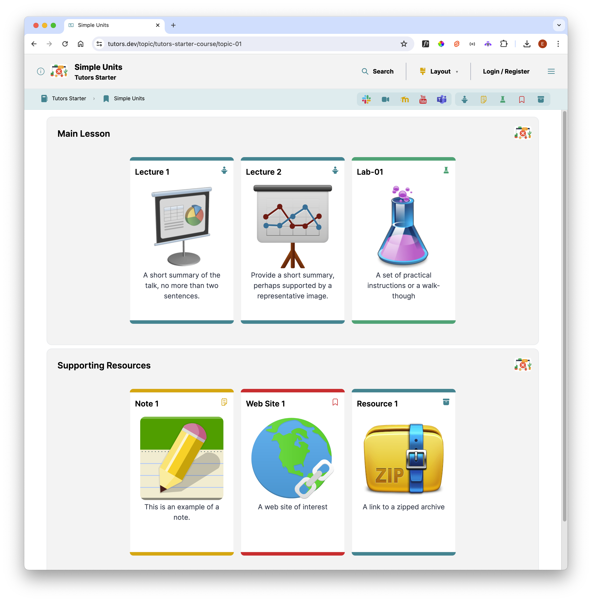

# Topics & Units

Expand the topic-01

Each topic folder represents a topic within a module, much like a chapter of a book. Each topic will be represented as a card on the course web:

The above cards above are generated from  `topic-01`, `topic-02`, and `topic-03` elements in the course.

You can create more topic folders by copying/pasting an existing one, just be sure to follow the naming convention `topic-**`, replacing the "\*" with digits to retain the sort order.

Units split each topic further, allowing for a clear definition of course content in each unit, and allowing for separate titles for each unit.  This is the layout of the `topic-01`:

You can see it contains 2 units.

You can create more unit folders by copying/pasting an existing one, just be sure to follow the naming convention `unit-*`, replacing the "\*" with a digit.

Try this now - create a new unit - say `unit-t`, and populate with:

- A Note
- A Lecture
- A Lab

You can use the note/lecture/lab from the existing units as examples. Perhaps change the titles + the images used for the cards.